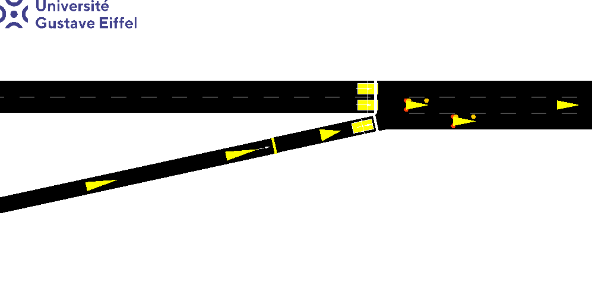
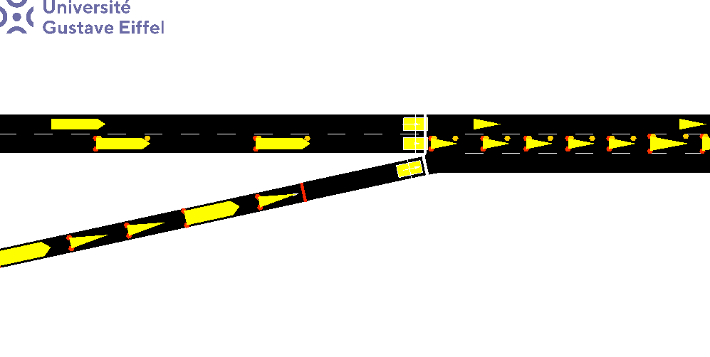

# D-DOC: DDPG-based Reinforcement Learning for Highway Ramp-Metering Control under Delayed Observations and Continuous-action Space

Cong-Son DUONG, Mohammed Adel Djelloul ABBOU, Francky RASATAHARISOA, Nikethan NIMALAKUMARAN, Lucas UCKERMANN, Nadir FARHI*

Report:  [Final Report](https://heyzine.com/flip-book/59e53eabc9.html)

## Introduction

Ramp metering is a crucial technique for managing traffic flow and minimizing congestion by regulating the rate at which vehicles enter a highway. However, practical ramp-metering systems often encounter challenges such as delayed sensor data and the need for continuous control signals. To address these challenges, we propose **D-DOC**, a Deep Deterministic Policy Gradient (DDPG)-based reinforcement learning framework specifically designed for ramp-metering control under both delayed state information and continuous action spaces.

The D-DOC approach adaptively learns optimal ramp metering rates that aim to reduce congestion on the ramp and maximize throughput on the highway freeway. This method is implemented and tested in the **SUMO** simulation environment, evaluating performance in two key scenarios: a constant flow scenario and a dynamic peak hour scenario.

The primary performance metrics—Traffic Flow, Average Speed, Density, and Travel Time—are gathered to assess the quality of control. Comparisons are made against traditional control methods (e.g., fixed or pre-timed signals) as well as reinforcement learning approaches such as ε-Greedy and DQN. The results demonstrate that D-DOC effectively manages ramp inflows, maintaining higher flow rates, reducing congestion, and improving overall travel conditions despite the presence of delayed observations.

## Simulation in SUMO
<!--  -->



This project uses the **SUMO** (Simulation of Urban MObility) environment to simulate traffic scenarios and evaluate the performance of the D-DOC framework. The simulation includes two main scenarios:
1. **Constant Flow Scenario**: Traffic flows are static, representing a typical non-peak scenario.
2. **Peak Hours Scenario**: A dynamic scenario from 8:15 to 8:45, where traffic flows fluctuate to simulate peak-hour congestion.

The reinforcement learning models (E-greedy, DQN, and DDPG) are trained and tested in these scenarios to evaluate the impact of the proposed D-DOC approach under different traffic conditions.

## Code Structure

The project is structured into the following files:

### Training Files
- **EGreedyAgent.py**: Contains the implementation for training the **E-greedy** reinforcement learning model.
- **DQNAgent.py**: Contains the implementation for training the **DQN (Deep Q-Network)** model.
- **DDPGAgent.py**: Contains the implementation for training the **DDPG (Deep Deterministic Policy Gradient)** model.

### Testing Files
- **test_normal.py**: A script to test the **normal scenario** with static flows (constant traffic).
- **test_peak.py**: A script to test the system under **peak hour** traffic conditions (8:15–8:45).
- **test_delayed_observation.py**: A script to test the impact of **delayed observations** on the ramp-metering control.

## Setup and Installation

To run the simulation and train the models, follow these steps:

### Requirements:
- **Python 3.7+**
- **SUMO** (Simulation of Urban MObility)
- **TensorFlow** (for DQN and DDPG implementations)
- **PyTorch** (for DDPG implementation)
- **NumPy** and **Matplotlib** (for numerical and graphical operations)

### Installation:

1. Install **SUMO**: Follow the [SUMO installation guide](https://sumo.dlr.de/docs/Installing/index.html) for your platform.
2. Clone the repository:
   ```bash
   git clone https://github.com/CongSon01/UGE-RL_Ramp.git
   cd UGE-RL_Ramp
